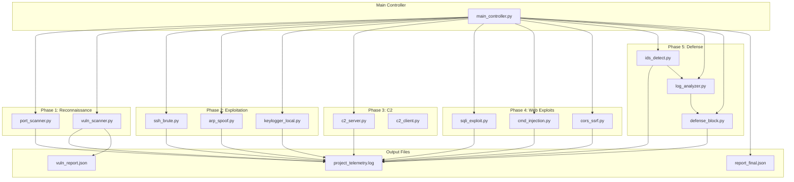

# Architecture Diagram

## Framework Overview (Mermaid)



## Data Flow

```
┌─────────────────────────────────────────────────────────────┐
│                    ATTACKER (Kali Linux)                     │
├─────────────────────────────────────────────────────────────┤
│  ┌─────────────┐                                            │
│  │   Main      │──────► Phase 1-4 Attack Modules            │
│  │ Controller  │                    │                        │
│  └─────────────┘                    │                        │
│         │                           ▼                        │
│         │              ┌────────────────────┐               │
│         │              │ project_telemetry  │◄──────────────┤
│         │              │      .log          │               │
│         │              └────────────────────┘               │
│         │                           │                        │
│         │                           ▼                        │
│         │              ┌────────────────────┐               │
│         └─────────────►│   Phase 5 IDS      │               │
│                        │   + Log Analyzer   │               │
│                        │   + Defense Block  │               │
│                        └────────────────────┘               │
│                                     │                        │
│                                     ▼                        │
│                        ┌────────────────────┐               │
│                        │  Countermeasures   │               │
│                        │  - Block IP        │               │
│                        │  - Isolate Host    │               │
│                        │  - Kill Processes  │               │
│                        └────────────────────┘               │
└─────────────────────────────────────────────────────────────┘
                              │
                              ▼
┌─────────────────────────────────────────────────────────────┐
│                    TARGET (Metasploitable/DVWA)              │
└─────────────────────────────────────────────────────────────┘
```

## MITRE ATT&CK Mapping

| Module | Technique ID | Technique Name |
|--------|--------------|----------------|
| Port Scanner | T1046 | Network Service Discovery |
| SSH Brute | T1110.001 | Brute Force: Password Guessing |
| ARP Spoof | T1557.002 | MITM: ARP Cache Poisoning |
| Keylogger | T1056.001 | Input Capture: Keylogging |
| C2 Server | T1071.001 | Application Layer Protocol |
| SQL Injection | T1190 | Exploit Public-Facing Application |
| Command Injection | T1059 | Command and Scripting Interpreter |
